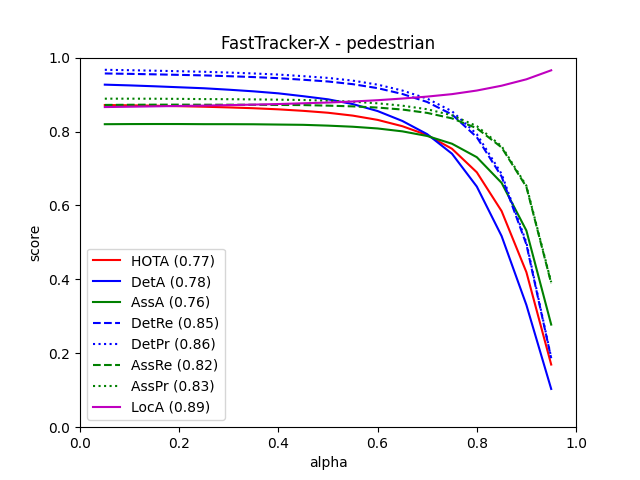
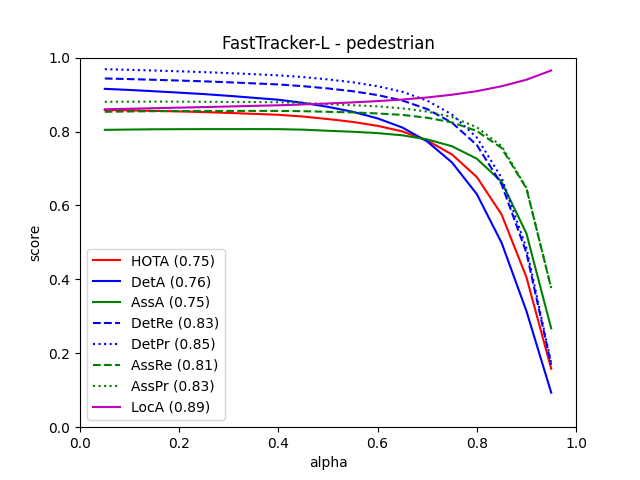
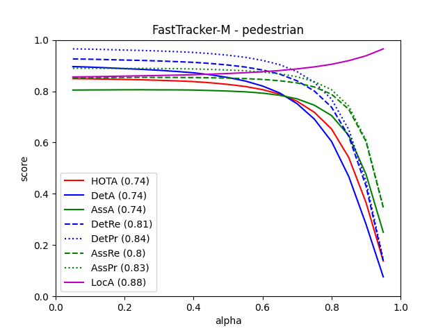
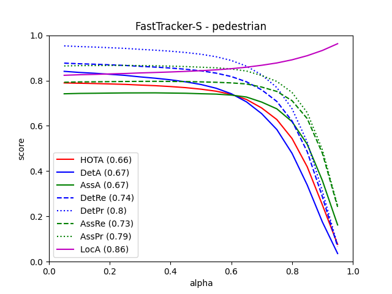
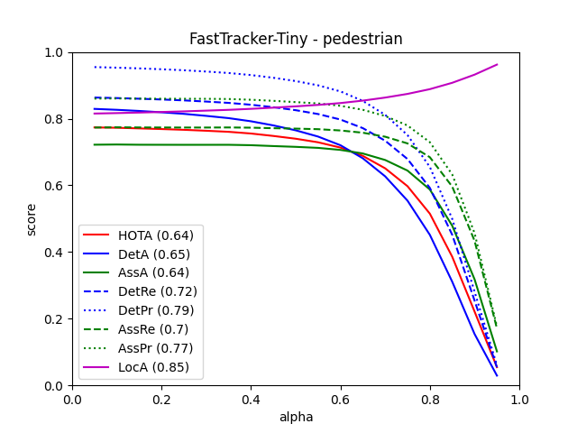
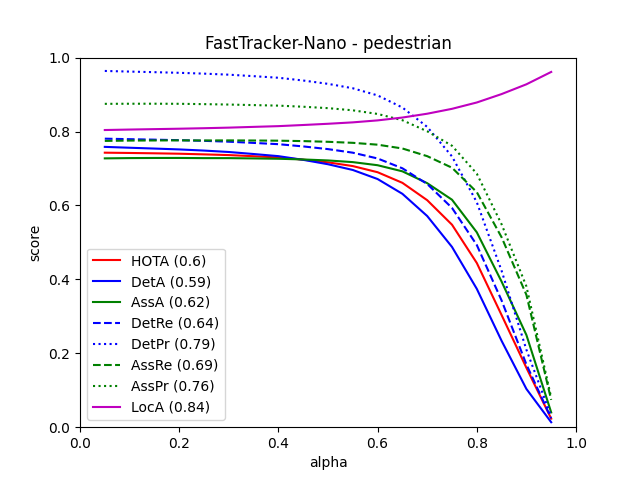

# FastTracker Backbone Benchmark Results

This document records the performance metrics for the FastTracker framework when paired with different YOLOX backbones on the MOT17 dataset.

**Evaluation Protocol:**
- **Dataset:** MOT17
- **Split:** `val_half`
- **Evaluation Tool:** `TrackEval` (via `run_eval.sh`)

---

## YOLOX-X

- **Experiment File:** `exps/example/mot/yolox_x_mix_det.py`
- **Checkpoint:** `pretrained/bytetrack_x_mot17.pth.tar`
- **Model Size (Params):** 99.00M
- **GFLOPs:** 987.11 (at 896x1600 resolution)

**Performance Metrics:**
| HOTA   | MOTA   | IDF1   | IDSW | FPS    |
|--------|--------|--------|------|--------|
| 76.516 | 88.618 | 85.921 | 240  | ~35.1   |

**Performance Graph:**
<div align="center">
  <div style="margin-bottom: 10px;">
    
    <p style="text-align: center;">YOLOX-X HOTA Curve</p>
  </div>
</div>

**Tracking Parameters (from `005_default.json`):**
```json
{
    "track_thresh": 0.7,
    "track_buffer": 30,
    "match_thresh": 0.85,
    "min_box_area": 100,
    "reset_velocity_offset_occ": 5,
    "reset_pos_offset_occ": 3,
    "enlarge_bbox_occ": 1.1,
    "dampen_motion_occ": 0.89,
    "active_occ_to_lost_thresh": 10,
    "init_iou_suppress": 0.7
}
```

---

## YOLOX-L

- **Experiment File:** `exps/example/mot/yolox_l_mix_det.py`
- **Checkpoint:** `pretrained/yolox_l.pth.tar`
- **Model Size (Params):** 54.15M
- **GFLOPs:** 437.83 (at 800x1440 resolution)

**Performance Metrics:**
| HOTA   | MOTA   | IDF1   | IDSW | FPS    |
|--------|--------|--------|------|--------|
| 75.093 | 86.664 | 83.806 | 237  | ~51.3   |

**Performance Graph:**
<div align="center">
  <div style="margin-bottom: 10px;">
    
    <p style="text-align: center;">YOLOX-L HOTA Curve</p>
  </div>
</div>

**Tracking Parameters (from `005_default.json`):**
```json
{
    "track_thresh": 0.7,
    "track_buffer": 30,
    "match_thresh": 0.85,
    "min_box_area": 100,
    "reset_velocity_offset_occ": 5,
    "reset_pos_offset_occ": 3,
    "enlarge_bbox_occ": 1.1,
    "dampen_motion_occ": 0.89,
    "active_occ_to_lost_thresh": 10,
    "init_iou_suppress": 0.7
}
```

---

## YOLOX-M

- **Experiment File:** `exps/example/mot/yolox_m_mix_det.py`
- **Checkpoint:** `pretrained/bytetrack_m_mot17.pth.tar`
- **Model Size (Params):** 25.28M
- **GFLOPs:** 207.35 (at 800x1440 resolution)

**Performance Metrics:**
| HOTA   | MOTA   | IDF1   | IDSW | FPS    |
|--------|--------|--------|------|--------|
| 73.721 | 85.096 | 83.511 | 277  | ~58.7   |

**Performance Graph:**
<div align="center">
  <div style="margin-bottom: 10px;">
    
    <p style="text-align: center;">YOLOX-M HOTA Curve</p>
  </div>
</div>

**Tracking Parameters (from `005_default.json`):**
```json
{
    "track_thresh": 0.7,
    "track_buffer": 30,
    "match_thresh": 0.85,
    "min_box_area": 100,
    "reset_velocity_offset_occ": 5,
    "reset_pos_offset_occ": 3,
    "enlarge_bbox_occ": 1.1,
    "dampen_motion_occ": 0.89,
    "active_occ_to_lost_thresh": 10,
    "init_iou_suppress": 0.7
}
```

---

## YOLOX-S

- **Experiment File:** `exps/example/mot/yolox_s_mix_det.py`
- **Checkpoint:** `pretrained/yolox_s.pth.tar` (or similar)
- **Model Size (Params):** 8.94M
- **GFLOPs:** 43.21 (at 800x1440 resolution)

**Performance Metrics:**
| HOTA   | MOTA   | IDF1   | IDSW | FPS    |
|--------|--------|--------|------|--------|
| 66.31  | 76.701 | 77.575 | 325  | ~74.5   |

**Performance Graph:**
<div align="center">
  <div style="margin-bottom: 10px;">
    
    <p style="text-align: center;">YOLOX-S HOTA Curve</p>
  </div>
</div>

**Tracking Parameters (from `005_default.json`):**
```json
{
    "track_thresh": 0.7,
    "track_buffer": 30,
    "match_thresh": 0.85,
    "min_box_area": 100,
    "reset_velocity_offset_occ": 5,
    "reset_pos_offset_occ": 3,
    "enlarge_bbox_occ": 1.1,
    "dampen_motion_occ": 0.89,
    "active_occ_to_lost_thresh": 10,
    "init_iou_suppress": 0.7
}
```

---

## YOLOX-Tiny

- **Experiment File:** `exps/example/mot/yolox_tiny_mix_det.py`
- **Checkpoint:** `pretrained/yolox_tiny.pth.tar` (or similar)
- **Model Size (Params):** 5.06M
- **GFLOPs:** ~6.45 (reference value @416x416)

**Performance Metrics:**
| HOTA   | MOTA   | IDF1   | IDSW | FPS    |
|--------|--------|--------|------|--------|
| 64.081 | 76.298 | 75.633 | 267  | ~77.1   |

**Performance Graph:**
<div align="center">
  <div style="margin-bottom: 10px;">
    
    <p style="text-align: center;">YOLOX-Tiny HOTA Curve</p>
  </div>
</div>

**Tracking Parameters (from `005_default.json`):**
```json
{
    "track_thresh": 0.7,
    "track_buffer": 30,
    "match_thresh": 0.85,
    "min_box_area": 100,
    "reset_velocity_offset_occ": 5,
    "reset_pos_offset_occ": 3,
    "enlarge_bbox_occ": 1.1,
    "dampen_motion_occ": 0.89,
    "active_occ_to_lost_thresh": 10,
    "init_iou_suppress": 0.7
}
```

---

## YOLOX-Nano

- **Experiment File:** `exps/example/mot/yolox_nano_mix_det.py`
- **Checkpoint:** `pretrained/yolox_nano.pth.tar` (or similar)
- **Model Size (Params):** 0.90M
- **GFLOPs:** 4.12 (at 800x1440 resolution)

**Performance Metrics:**
| HOTA   | MOTA   | IDF1   | IDSW | FPS    |
|--------|--------|--------|------|--------|
| 60.498 | 69.801 | 74.395 | 174  | ~64.0   |

**Performance Graph:**
<div align="center">
  <div style="margin-bottom: 10px;">
    
    <p style="text-align: center;">YOLOX-Nano HOTA Curve</p>
  </div>
</div>

**Tracking Parameters (from `005_default.json`):**
```json
{
    "track_thresh": 0.7,
    "track_buffer": 30,
    "match_thresh": 0.85,
    "min_box_area": 100,
    "reset_velocity_offset_occ": 5,
    "reset_pos_offset_occ": 3,
    "enlarge_bbox_occ": 1.1,
    "dampen_motion_occ": 0.89,
    "active_occ_to_lost_thresh": 10,
    "init_iou_suppress": 0.7
}
```